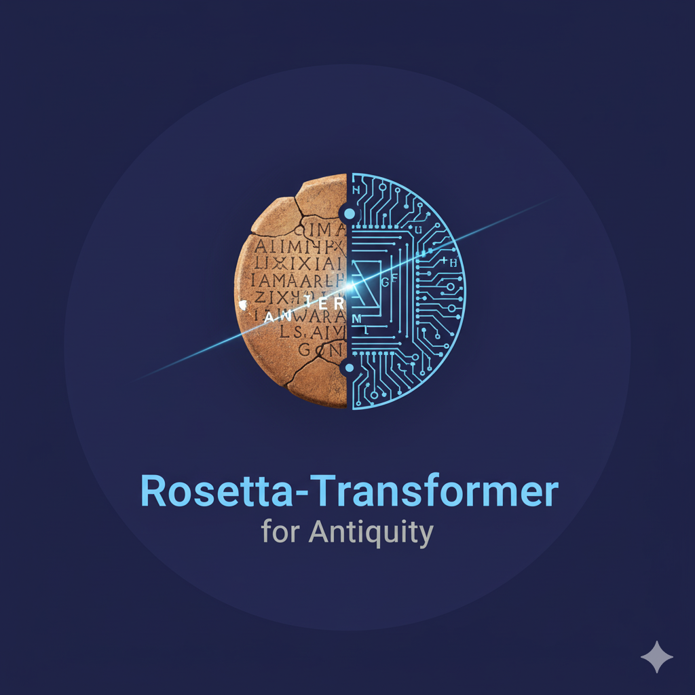

# Rosetta-Transformer-for-Antiquity
[](https://github.com/AyhamJo7/Rosetta-Transformer-for-Antiquity/actions/workflows/ci.yml)
[](https://www.python.org/downloads/)
[](https://opensource.org/licenses/MIT)

<p align="center">
  
</p>

A multilingual Transformer-based system to aid in the deciphering, analysis, and scholarly exploration of ancient and low-resource texts. This project provides a full-stack environment for corpus curation, model training, and interactive analysis.

## Overview

The Rosetta-Transformer project is designed to support historians, linguists, and epigraphers by leveraging modern NLP to accelerate their research. It provides tools for:

1.  **Corpus Curation**: Ingesting, cleaning, and normalizing textual data from ancient sources.
2.  **Domain Pretraining**: Adapting powerful language models to the specific vocabularies and grammatical structures of ancient languages.
3.  **Task Finetuning**: Training models for specific scholarly tasks like Named Entity Recognition (NER), Relation Extraction (RE), Part-of-Speech (POS) tagging, transliteration, and translation.
4.  **Interactive Analysis**: A web-based tool for exploring the corpus, examining model predictions, providing corrections, and running semantic searches.

The system is built with a focus on **reproducibility, transparency, and expert-in-the-loop collaboration**.

## Getting Started

*Detailed setup instructions will be added here.*

```bash
# Example commands
make setup
make run-dev
```

## Research & Methodology

*This section will detail the modeling choices, evaluation strategies, and research findings.*
